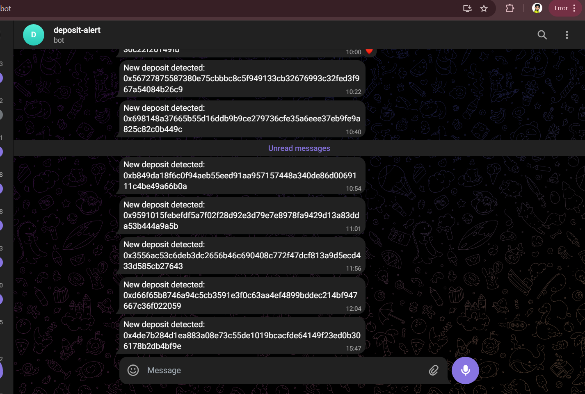

# Ethereum Deposit Tracker

This project tracks Ethereum deposits on the Beacon Deposit Contract and provides metrics for visualization using Prometheus and Grafana.

## Table of Contents

1. [Project Description](#project-description)
2. [Prerequisites](#prerequisites)
3. [Project Structure](#project-structure)
4. [Setup Instructions](#setup-instructions)
5. [Configuration](#configuration)
6. [Running the Application](#running-the-application)
7. [Telegram Bot Integration](#telegram-bot-integration)

## Project Description

This project tracks Ethereum deposits on the Beacon Deposit Contract. It collects deposit data, saves it to MongoDB, and exposes metrics via Prometheus. Grafana is used for visualizing the data.

## Prerequisites

- Docker
- Docker Compose
- Node.js

## Project Structure

### File and Directory Descriptions

- **`src/app.js`**: Main application entry point. Monitors ETH deposits, updates metrics, and sends notifications.
- **`src/db.js`**: Database connection configuration for MongoDB.
- **`src/fetchDeposits.js`**: Module for fetching deposit transactions from the Ethereum network.
- **`src/metrics.js`**: Defines Prometheus metrics and sets up the metrics endpoint.
- **`src/saveDeposits.js`**: Module for saving deposit details to MongoDB.
- **`src/notifications.js`**: Module for sending notifications via Telegram Bot(deposit-alert).
- **`models/Deposit.js`**: Mongoose model for the deposit schema in MongoDB.
- **`logs/combined.log`**: Log file for application logs.
- **`docker-compose.yml`**: Docker Compose configuration file for setting up the development environment with MongoDB, Grafana, Prometheus, and your application.
- **`prometheus.yml`**: Prometheus configuration file for scraping metrics from various sources.
- **`.env`**: Environment configuration file containing sensitive information and configuration settings.
- **`package.json`**: Node.js package configuration file, including dependencies and scripts.
- **`README.md`**: Project documentation file.


## Setup Instructions

### 1. Clone the Repository

```bash
git clone https://github.com/Vaibhav-shrivastav/luganodes-task
cd luganodes-task
```

### 2. Create a .env File

Create a .env file in the root directory of the project with the following variables:

```bash
RPC_URL=https://eth-mainnet.alchemyapi.io/v2/your_api_key
BEACON_DEPOSIT_CONTRACT=0x00000000219ab540356cBB839Cbe05303d7705Fa
METRICS_PORT=9091
TELEGRAM_BOT_TOKEN=YOUR_TELEGRAM_BOT_TOKEN
TELEGRAM_CHAT_ID=YOUR_TELEGRAM_CHAT_ID
ALCHEMY_API_KEY=YOUR_ALCHEMY_API_KEY
MONGODB_URI=mongodb://localhost:27017
```

Replace placeholders with your actual credentials and settings.

### 3. Build and Run Docker Containers

Use Docker Compose to build and start all services:

```bash
docker-compose up --build
```

This will start the following services:

- MongoDB
- Grafana
- Prometheus
- MongoDB Exporter
- Ethereum Deposit Tracking Application

### 4. Access the Services

- Grafana: Open `http://localhost:3000` in your web browser. Log in with the default credentials `(admin/admin)` and set up the Prometheus data source.
- Prometheus: Open `http://localhost:9090` to view and query metrics.
- Metrics Endpoint: Access your application’s metrics at `http://localhost:9091/metrics`

### 5. Configure Grafana Dashboards

1. **Add Prometheus Data Source:**
   - Go to Configuration (gear icon) -> Data Sources.
   - Click Add data source and select Prometheus.
   - Set the URL to `http://prometheus:9090` and click Save & Test.
2. **Create Dashboards:**
   - Go to Dashboards -> New Dashboard.
   - Add a new panel for each visualization:
     - Deposit Count Over Time: Use a Time Series panel with the query `eth_deposit_count`.
     - Deposit Fee Distribution: Use a Histogram or Bar Chart panel with the query `eth_deposit_fee`.

## Configuration

- Metrics Port: Configurable via the `.env` file.
- Telegram Alerts: Set your Telegram bot token and chat ID in the `.env` file.

## Running the Application

The application runs as a Docker container and will automatically start with Docker Compose.


## Telegram Bot Integration

The Ethereum Deposit Tracker includes integration with Telegram for alerting users about new deposits. Here's how to set it up and use it:

### Setting Up the Telegram Bot

1. **Create a Telegram Bot**:
   - Open the Telegram app and search for the "BotFather" bot.
   - Start a chat with BotFather and use the `/newbot` command to create a new bot.
   - Follow the instructions to get your new bot's API token.

2. **Obtain Your Chat ID**:
   - Start a chat with your bot and send a message to it.
   - Visit `https://api.telegram.org/bot<YOUR_BOT_TOKEN>/getUpdates` to find your chat ID in the response.

### Configuration

Add the following environment variables to your `.env` file:

```env
TELEGRAM_BOT_TOKEN=your_bot_token_here
TELEGRAM_CHAT_ID=your_chat_id_here
```

Here is a screenshot of the Telegram bot functionality:
- Notifies when deposit transaction is detected.




